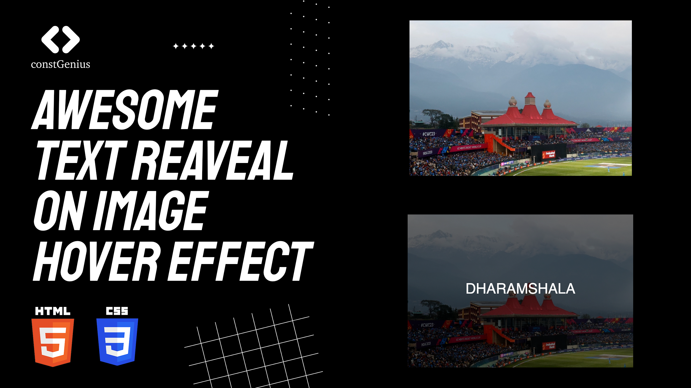

# Awesome Text Reveal on Image Hover Effect using HTML CSS

Create an engaging user experience with an eye-catching text reveal on image hover effect using the power of HTML and CSS. This dynamic design feature allows users to interact with your content, revealing captivating text or information that enhances the visual appeal of your website. By seamlessly integrating this effect, you can effortlessly draw attention to key messages, promotions, or product details, leaving a lasting impression on your audience.

Live Preview: https://constgenius.github.io/TextReveal/

